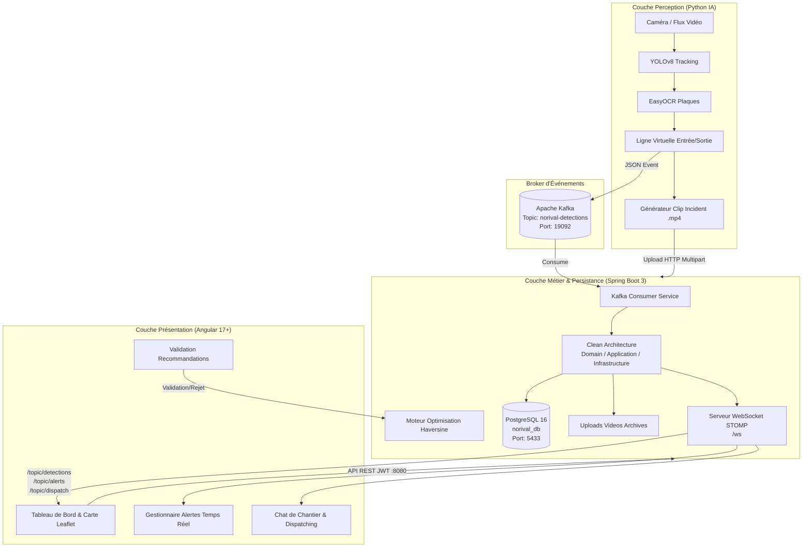

# 🚛 NORIVAL - Système Distribué d'Optimisation Logistique & Vision Temps Réel

[](https://spring.io/projects/spring-boot)
[](https://adoptium.net/)
[](https://www.python.org/)
[](https://github.com/ultralytics/ultralytics)
[](https://kafka.apache.org/)
[](https://www.postgresql.org/)
[](https://angular.dev/)
[](https://www.docker.com/)

---

## 📖 Sommaire

- [Présentation du Projet](#-présentation-du-projet)
- [Fonctionnalités Clés](#-fonctionnalités-clés)
- [Architecture Logicielle](#-architecture-logicielle)
- [Règles de Gestion Métier (RG)](#-règles-de-gestion-métier-rg)
- [Stack Technologique](#-stack-technologique)
- [Structure du Projet](#-structure-du-projet)
- [Prérequis](#-prérequis)
- [Guide d'Installation & Démarrage](#-guide-dinstallation--démarrage)
  - [Option 1 : Démarrage Rapide (Script PowerShell)](#option-1--démarrage-rapide-script-powershell)
  - [Option 2 : Démarrage Manuel Étape par Étape](#option-2--démarrage-manuel-étape-par-étape)
- [Comptes de Test (Démo)](#-comptes-de-test-démo)
- [Spécifications des API & WebSockets](#-spécifications-des-api--websockets)
- [Conception & Diagrammes UML](#-conception--diagrammes-uml)
- [Contribution & Licence](#-contribution--licence)

---

## 🌟 Présentation du Projet

Le système **NORIVAL** est une plateforme industrielle distribuée de pilotage logistique et de sécurisation multi-chantiers (TCE - Tous Corps d'État). Conçu selon les principes de l'**Event-Driven Architecture (EDA)** et de la **Clean Architecture**, il résout les défis opérationnels majeurs du secteur du BTP :

1. **Visibilité temps réel** sur les flux d'engins et de camions entre carrières, dépôts et chantiers.
2. **Sécurité et conformité d'accès** via l'analyse de flux vidéo par vision artificielle (YOLOv8 + EasyOCR).
3. **Optimisation logistique opérationnelle** par calcul géodésique pour minimiser les trajets à vide.
4. **Réactivité instantanée** grâce au streaming d'événements Kafka et aux notifications WebSockets bi-directionnelles.

---

## 🚀 Fonctionnalités Clés

- 📍 **Cartographie Interactive en Direct** : Suivi cartographique Leaflet de la position des engins, des statuts (`DISPONIBLE`, `EN_TRANSIT`, `EN_PANNE`) et des périmètres de chantiers (Geofencing).
- 👁️ **Perception & Vision par Ordinateur** :
  - Détection et suivi automatique d'engins par modèle **YOLOv8**.
  - Reconnaissance automatique des plaques d'immatriculation (LPR / ANPR) via **EasyOCR** (caractères latins et arabes).
  - Ligne virtuelle de franchissement (*Tripwire*) pour horodater avec précision les entrées/sorties.
- 🚨 **Gestion des Alertes & Enregistrement Automatique d'Incidents** :
  - Détection d'accès non autorisé (véhicule inconnu ou affecté à un autre chantier).
  - Enregistrement automatique d'un clip vidéo de 6 secondes (buffer circulaire de 30 frames avant/après incident) et téléversement instantané vers le backend.
  - Diffusion immédiate de l'alerte critique sur le tableau de bord des superviseurs via WebSockets.
- 📐 **Moteur d'Optimisation Logistique** :
  - Algorithme d'affectation optimale minimisant les distances (formule Haversine).
  - Génération de recommandations avec possibilité de validation ou de rejet argumenté par le superviseur.
- 📦 **Gestion Centralisée du Matériel & Stocks** : Contrôle strict des transferts entre le dépôt central et les chantiers satellites.
- 💬 **Messagerie & Dispatching Instantané** : Canaux de communication dédiés par chantier et transmission d'ordres de mission aux conducteurs.

---

## 🏗️ Architecture Logicielle

Le projet repose sur une architecture distribuée, hautement disponible et asynchrone :



---

## ⚖️ Règles de Gestion Métier (RG)

Le système implémente et fait respecter automatiquement les règles métier suivantes :

| Identifiant | Intitulé | Description de l'implémentation |
| :--- | :--- | :--- |
| **RG-01** | **Géofencing Chantier** | Détection automatique de la présence d'un véhicule dans le rayon géographique paramétré du chantier. |
| **RG-02** | **Filtre Anti-Rebond** | Une détection d'entrée ou sortie n'est validée qu'après deux passages successifs confirmés (mémorisation dynamique en mémoire via `ConcurrentHashMap`). |
| **RG-03** | **Temps Réel Critique (< 5s)** | Toute détection d'accès non autorisé génère une alerte critique propagée en moins de 5 secondes au frontend via Kafka et WebSockets. |
| **RG-06** | **Chantiers Actifs Uniquement** | Le moteur d'optimisation exclut automatiquement les chantiers au statut `CLOTURE` des calculs de réaffectation. |
| **RG-07** | **Contrôle des Stocks Matériels** | La quantité de matériel réservée pour un chantier ne peut en aucun cas excéder la quantité disponible au dépôt central. |
| **RG-08** | **Exclusivité Conducteur / Engin** | Un conducteur ne peut être affecté qu'à un seul engin actif à un instant donné. |
| **RG-09** | **Sécurité des Clôtures d'Alertes** | Une alerte clôturée ne peut être rouverte que par un profil habilité (**Agent HSE** ou **Administrateur**). |

---

## 💻 Stack Technologique

### Couche Perception & IA
- **Python 3.10+**
- **Ultralytics YOLOv8** (Détection et suivi multi-objets)
- **EasyOCR** (OCR multilingue arabe / anglais)
- **OpenCV (cv2)** & **ImageIO** (Traitement vidéo et capture de flux)
- **kafka-python** & **requests**

### Broker de Messages
- **Apache Kafka 7.5.0** (Mode KRaft sans Zookeeper)

### Backend Métier
- **Java 21 (LTS)**
- **Spring Boot 3.3.1**
- **Spring Security** avec authentification sans état **JWT (jjwt 0.11.5)**
- **Spring Data JPA** & **Hibernate**
- **Spring WebSocket / STOMP** (Messagerie push temps réel)
- **Spring Kafka**
- **Spring Mail** (Notifications SMTP)
- **PostgreSQL 16 Alpine**

### Frontend
- **Angular 17+** (Architecture modulaire standalone)
- **NgRx Store & Effects** (State management réactif)
- **Leaflet & OpenStreetMap** (Cartographie interactive)
- **Chart.js** (Visualisation des métriques et rotations)
- **SockJS Client** & **STOMP.js** (Consommation des flux WebSockets)

---

## 📁 Structure du Projet

```text
vision-logistique-temps-reel-main/
│
├── docker-compose.yml             # Orchestration PostgreSQL 16 & Kafka (KRaft)
├── start_project.ps1              # Script PowerShell de démarrage automatique en 1 clic
├── Rapport_Technique_Final.md     # Synthèse technique et rapport d'ingénierie
│
├── Conception/                    # Spécifications et diagrammes d'architecture
│   ├── Cahier_des_Charges_Norival.pdf
│   ├── diagclass.jpeg             # Diagramme de classes UML
│   ├── sequence.jpeg              # Diagramme de séquence UML
│   └── usecase.jpeg               # Diagramme des cas d'utilisation UML
│
├── norival-backend/               # API REST & Core Métier (Spring Boot 3.3.1)
│   ├── src/main/java/com/norival/norival_backend/
│   │   ├── application/           # Cas d'utilisation (OptimizationService, VehiculeUseCase)
│   │   ├── domain/                # Entités métier pures et interfaces repository
│   │   └── infrastructure/        # Controllers REST, Sécurité JWT, Kafka, WebSockets, JPA
│   ├── src/main/resources/
│   │   └── application.properties # Configuration (DB port 5433, Kafka 19092, Server 8080)
│   ├── uploads/videos/            # Stockage des clips vidéo d'anomalies
│   └── pom.xml
│
├── norival-ai/                    # Pipeline de Vision Artificielle & Détection
│   ├── main.py                    # Script YOLOv8 + EasyOCR + Tripwire + Kafka Producer
│   └── requirements.txt           # Dépendances Python
│
└── norival-frontend/              # Dashboard Web (Angular 17+)
    ├── src/app/
    │   ├── components/            # Carte, Alertes, Chat, Matériel, Flotte
    │   ├── core/                  # Services HTTP, WebSocket STOMP, Modèles
    │   └── state/                 # NgRx Actions, Reducers, Selectors
    └── package.json
```

---

## ⚙️ Prérequis

Assurez-vous d'avoir installé sur votre machine :
- [Docker Desktop](https://www.docker.com/products/docker-desktop/) (avec Docker Compose activé)
- [Java Development Kit (JDK) 21](https://adoptium.net/)
- [Node.js 18+](https://nodejs.org/) & `npm`
- [Python 3.10+](https://www.python.org/downloads/) avec `pip`

---

## 🚀 Guide d'Installation & Démarrage

### Option 1 : Démarrage Rapide (Script PowerShell)

Sous Windows, exécutez le script d'automatisation à la racine :

```powershell
.\start_project.ps1
```
*Ce script lance automatiquement les conteneurs Docker, le backend Spring Boot, le frontend Angular et le module IA Python dans des terminaux dédiés.*

---

### Option 2 : Démarrage Manuel Étape par Étape

#### 1. Démarrer l'infrastructure Docker (PostgreSQL & Kafka)

À la racine du projet :
```bash
docker-compose up -d
```
Vérifiez que les conteneurs sont sains :
- PostgreSQL écoute sur `localhost:5433`
- Apache Kafka écoute sur `localhost:19092`

#### 2. Démarrer le Backend Spring Boot

Ouvrez un terminal dans le dossier `norival-backend` :
```bash
cd norival-backend
./mvnw clean spring-boot:run
```
*(Sous Windows, utilisez `mvnw.cmd spring-boot:run`)*.

> ℹ️ **Note :** Au premier démarrage, `DbInitializerConfig` initialise automatiquement les chantiers (Bouskoura, Mohammedia), les véhicules et les profils utilisateurs dans la base PostgreSQL. L'API est accessible sur `http://localhost:8080`.

#### 3. Démarrer le Frontend Angular

Ouvrez un terminal dans le dossier `norival-frontend` :
```bash
cd norival-frontend
npm install
npm start
```
L'interface utilisateur est disponible sur : **`http://localhost:4200`**.

#### 4. Lancer le Module d'IA & Vision par Ordinateur

Ouvrez un terminal dans le dossier `norival-ai` :
```bash
cd norival-ai
pip install -r requirements.txt
python main.py
```
Le script se connecte au backend pour récupérer les véhicules autorisés, ouvre le flux vidéo (webcam ou fichier), effectue l'inférence YOLOv8 et EasyOCR, et publie les événements sur Kafka.

---

## 👥 Comptes de Test (Démo)

Le système injecte automatiquement un jeu de données de test avec différents profils métiers :

| Rôle | Email de connexion | Mot de passe | Périmètre & Droits |
| :--- | :--- | :--- | :--- |
| **Superviseur Logistique** | `logistique@norival.com` | `pass123` | Vue globale flotte, validation des optimisations, gestion du matériel |
| **Agent HSE** | `hse@norival.com` | `pass123` | Gestion prioritaire des alertes d'incidents, clôture et réouverture d'anomalies |
| **Chef de Chantier 1** | `chef1@norival.com` | `pass123` | Chantier Bouskoura (Chat, validation d'arrivées, alertes locales) |
| **Chef de Chantier 2** | `chef2@norival.com` | `pass123` | Chantier Mohammedia |
| **Conducteur** | `ahmed@norival.com` | `pass123` | Réception des ordres de dispatching et pointage en direct |

---

## 📡 Spécifications des API & WebSockets

### Principaux Endpoints REST (`http://localhost:8080/api`)

- **Authentification** :
  - `POST /auth/login` : Authentification et obtention du jeton JWT.
- **Chantiers & Véhicules** :
  - `GET /chantiers` : Liste des chantiers avec coordonnées et rayons.
  - `GET /vehicules` : Liste des véhicules avec statut et position GPS.
  - `PUT /vehicules/{id}/position` : Mise à jour de la position GPS (avec contrôle Geofencing).
  - `PUT /vehicules/{id}/depart?chantierId={id}` : Déclaration de sortie de chantier.
  - `PUT /vehicules/{id}/arrivee?chantierId={id}` : Déclaration d'arrivée sur site.
  - `PUT /vehicules/{id}/panne` : Déclaration immédiate de panne mécanique.
- **Optimisation Logistique** :
  - `GET /optimization/optimize` : Calcul des réaffectations optimales d'engins.
  - `GET /optimization/recommandations` : Liste des recommandations générées.
  - `POST /optimization/recommandations/{id}/valider` : Validation d'une recommandation.
  - `POST /optimization/recommandations/{id}/rejeter?motif=...` : Rejet motivé.
- **Vidéos & Preuves d'Anomalies** :
  - `GET /videos` : Liste des vidéos archivées.
  - `POST /videos/upload` : Téléversement multipart d'un clip d'anomalie.
- **Matériel & Gestion de Stocks** :
  - `GET /materiel` / `POST /materiel` : Suivi des équipements et stocks selon la règle RG-07.
- **Chat & Dispatch** :
  - `GET /chat/history/{chantierId}` : Historique des échanges par chantier.
  - `POST /dispatch` : Création et transmission d'une mission de transport.

### Canaux WebSockets STOMP (`/ws`)

| Topic WebSocket | Rôle et Charge Utile |
| :--- | :--- |
| `/topic/detections` | Mouvements de véhicules (entrées, sorties, mises à jour de position et statut). |
| `/topic/alerts` | Diffusion instantanée des alertes critiques (intrusions, pannes, accès refusé). |
| `/topic/videos` | Notification d'une nouvelle vidéo d'anomalie enregistrée et disponible au visionnage. |
| `/topic/chat/{chantierId}` | Échanges instantanés entre chefs de chantiers et superviseurs. |
| `/topic/dispatch` | Ordres de mission et affectations envoyés aux conducteurs. |

---

## 📐 Conception & Diagrammes UML

Les modèles d'ingénierie détaillés sont consultables dans le répertoire `Conception/` :
- `diagclass.jpeg` : Diagramme de classes détaillant les relations entre Chantiers, Véhicules, Conducteurs, Matériels et Alertes.
- `sequence.jpeg` : Diagramme de séquence explicitant la chaîne de détection (Caméra ➔ IA ➔ Kafka ➔ Spring Boot ➔ WebSocket ➔ Navigateur).
- `usecase.jpeg` : Diagramme des cas d'utilisation par acteur (Superviseur, HSE, Chef de Chantier, Conducteur).
- `Cahier_des_Charges_Norival.pdf` : Cahier des charges fonctionnel et technique complet du projet.

---

## 📄 Contribution & Licence

Projet développé dans le cadre du cursus d'Ingénierie des Systèmes d'Information (Projet de Fin d'Année - Stage 4IIR).

- **Propriété intellectuelle** : Société NORIVAL & Équipe Projet.
- **Licence** : Usage académique et démonstratif.
